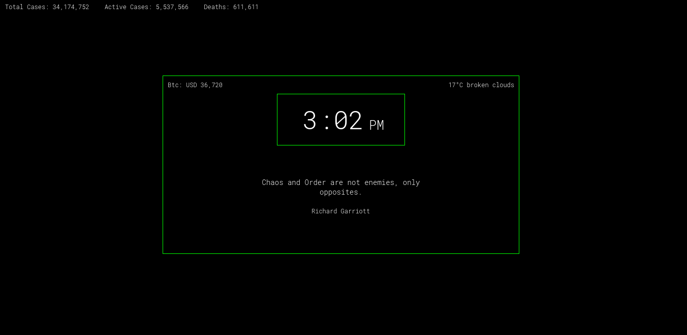

# Minimal-startpage
Some simple startpage for qutebrowser with information, like Covid-19 stats and daily quotes etc..

## Screenshot

## Notes

First edit your preferred configs in **config.js** file, this startpage gets info from the api's below

**Covid-19** : https://github.com/javieraviles/covidAPI 

**Btc Price** : https://www.coindesk.com/coindesk-api

**Weather** : https://openweathermap.org/api

**Quotes** : https://github.com/lukePeavey/quotable

Special thanks to the people who made these free apis :)

